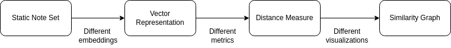

# Project Abstract

## Team Composition

- Matteo Merler - matteo.merler@aalto.fi
- Sergio Hernandez - sergio.hernandezgutierrez@aalto.fi
- Roope Kajoluoto - roope.kajoluoto@aalto.fi

## Abstract

Given a fixed set of documents, we want to construct a similarity graph based on a vector-space representation of such documents, with a potential additional task of clustering such documents with automatic labelling. We will build a pipeline to first represent the documents in a vector space, then calculating pair-wise distances between documents in the vector space, and finally using a distance threshold to connect documents in the 2D graph. We will attempt to build each step of this pipeline using different methods; an analysis and comparison of the results each method yields will be a section of our final report.

Our plan is to construct a dataset made up of various news articles from different categories and attempt to link similar articles together. The API we're planning on using also returns some keywords to categorize the articles, so we can use this as a ground truth to compare our results with. We expect articles that are linked together to be similar in content, and we expect the keywords to be similar as well. We can also look at the visualization the graph will produce to see if the articles are clustered together in a way that makes sense.

A potential more useful use case for this project would be categorizing and visualizing similar notes in a note app. This is actually what our main idea is, but since finding a dataset of notes is difficult, we decided to use news articles as a substitute. We can use the same pipeline to construct a graph of similar notes, and we can use the keywords as labels for the notes. We can also use the graph to visualize the notes and see if they are clustered together in a way that makes sense. If the project is succesful and we have time, we can try to implement this idea with a note app.
